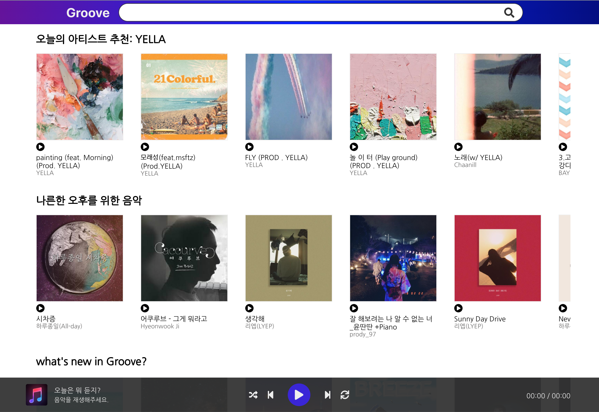

# groove
  
음악 스트리밍 서비스 groove입니다. 
배포 주소: https://groov.space

### 참여 개발자 및 역할 분담
- 김형준 (backend, devops, CI/CD)
- 정수민 (frontend)

### 사용 기술
- frontend: reactJS
- api: go(gin)
- Container & Orchestration: Docker, Kubernetes
- CI: travisCI
- Public Cloud: GCP
